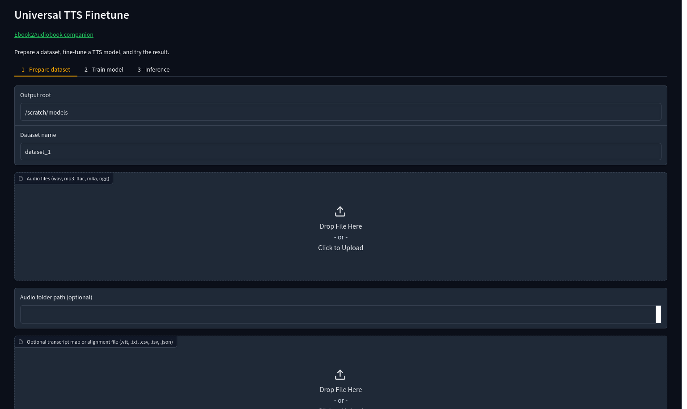
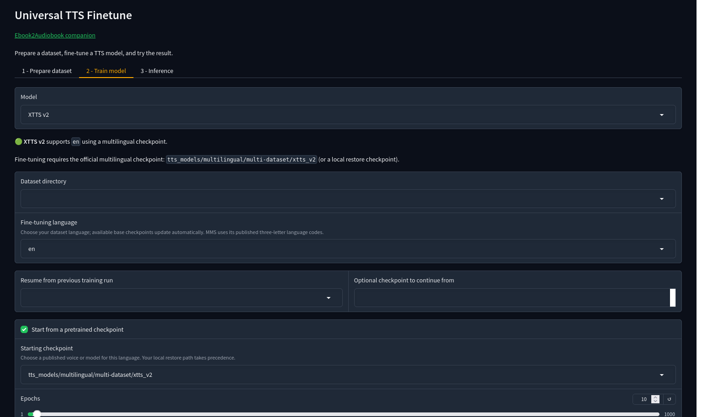

# Universal TTS Finetune

Supports 1,107+ languages!

Prepare recordings, fine-tune a TTS model, and try the result in your browser. UFT has 20 training engines and runs independently of [ebook2audiobook](https://github.com/DrewThomasson/ebook2audiobook).



## Start with Docker

```bash
git clone https://github.com/DrewThomasson/Universal_TTS_Finetune.git
cd Universal_TTS_Finetune
mkdir -p models finetune_models audio_data
export UFT_UID=$(id -u) UFT_GID=$(id -g)
docker compose up --build
```

Open **http://localhost:7862**. Put recordings in `audio_data/` and select `/app/audio_data` in the GUI. For CPU only, use `docker compose -f docker-compose.cpu.yml up --build`. The default Docker setup needs an NVIDIA GPU and the NVIDIA Container Toolkit.

## Or install locally

Install [uv](https://docs.astral.sh/uv/getting-started/installation/) and Python 3.12:

```bash
git clone https://github.com/DrewThomasson/Universal_TTS_Finetune.git
cd Universal_TTS_Finetune
uv venv --python 3.12 .venv
source .venv/bin/activate
uv pip install -r requirements.txt
python web_gui.py
```

On Windows, activate with `.venv\Scripts\activate`. Open **http://localhost:7862**.

## Fine-tune a voice

1. **Prepare:** Add short WAV clips and matching transcripts if you have them. You can also use an E2A audiobook with its `.vtt` file. Without transcripts, UFT can transcribe with Whisper or MMS ASR; select the dataset language first. [Multilingual prompt files](https://huggingface.co/drewThomasson/fineTunedTTSModels/tree/main/TTSDistilationDatasets) can help create test clips.
2. **Train:** Choose an engine, language, starting checkpoint, and device. The GUI shows a RAM/VRAM estimate and warns when a language has no mapped checkpoint. Managed optional runtimes install on first use and reuse their downloads; F5-TTS currently needs a separate environment. See [engine options](ENGINE_OPTIONS.md).
3. **Try it:** Open **Inference**, select the finished run, and generate audio. Add a speaker reference WAV when the selected engine asks for one.

<details>
<summary>See the training controls</summary>



</details>

Prepared datasets and finished runs are saved in `finetune_models/` by default. Downloaded models and optional runtimes are saved in `models/`. Keep each run's `ready/artifacts.json` with its model files. Docker keeps these folders on your host.

For an E2A custom voice, **Create E2A upload ZIP** appears in Inference when E2A accepts that engine's format (XTTS v1/v2, VITS, MMS/Fairseq VITS, Piper).

## Command line

The CLI uses the same setup and models as the GUI. For example:

```bash
python headless_cli.py list-models
python headless_cli.py list-checkpoints --model mms_vits --language ace
python headless_cli.py prepare-dataset \
  --audio-dir /path/to/wavs --transcript-file /path/to/transcripts.csv \
  --language ace --output-root ./finetune_models
python headless_cli.py train \
  --model mms_vits --language ace \
  --dataset-dir ./finetune_models/dataset/LJSpeech-1.1 \
  --output-root ./finetune_models
```

Use `python headless_cli.py --help` for all commands and options. See [engine options](ENGINE_OPTIONS.md) for language, hardware, setup, and license notes, and [engine verification](ENGINE_VERIFICATION.md) for recorded test results.
